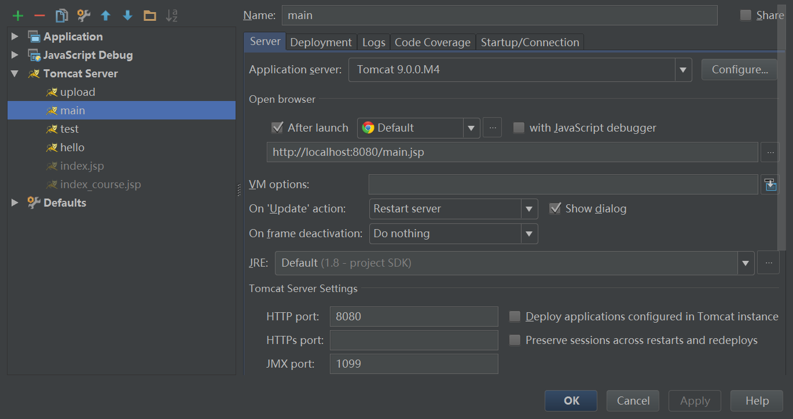

# Java Web 环境搭建作业

### 1.安装并配置开发环境
已经完成。

### 2.利用eclipse开发第一个hello world程序
本人使用IntelliJ IDEA<br>
(工程已经过较大改动，故无法上图)
<br>
```
<html>
<body>
<%
out.println("Hello World");
%>
</body>
</html>
```

### 3.将程序部署到tomcat服务器，通过浏览器查看


### 4.在网页中显示数据库的信息
* 建立了一个表的实体类
```Java
public class Student {
    private int id;
    private String name;

    public int getId(){
        return id;
    }

    public void setId(int id){
        this.id = id;
    }

    public String getName(){
        return name;
    }

    public void setName(String name){
        this.name = name;
    }

    public Student(int id,String name){
        super();
        this.name = name;
        this.id = id;
    }
}
```
* 建立一个工具类
```Java
public class StudentOperation {
    public List readStudent(){
        List<Student> list = new ArrayList<>();
        com.mysql.jdbc.Connection connection = null;
        PreparedStatement preparedStatement = null;
        ResultSet resultSet = null;

        try{
            Class.forName("com.mysql.jdbc.Driver");
        }catch (ClassNotFoundException e){
            e.printStackTrace();
        }
        try{
            connection = (com.mysql.jdbc.Connection) DriverManager.getConnection("jdbc:mysql://localhost:3306/student","root",null);
            String sql = "SELECT * FROM student WHERE student_id>=?";
            preparedStatement = connection.prepareStatement(sql);
            preparedStatement.setInt(1,1);
            resultSet = preparedStatement.executeQuery();
            while(resultSet.next()){
//                int id = resultSet.getInt("student_id");
                String studentName = resultSet.getString("student_name");
                int studentId = resultSet.getInt("student_id");
                Student student = new Student(studentId,studentName);
                list.add(student);
            }
        }catch (SQLException e){
            e.printStackTrace();
        }finally {
            try{
                if(resultSet!=null){
                    resultSet.close();
                }
                if(preparedStatement!=null){
                    preparedStatement.close();
                }
                if(connection!=null){
                    connection.close();
                }
            }catch (SQLException e){
                e.printStackTrace();
            }
        }
        return list;
    }
    public static void main(String[] args){
        StudentOperation studentOperation = new StudentOperation();
        List<Student> list = studentOperation.readStudent();
        System.out.println(list.size());
        for(Student student : list){
            System.out.println(student.getName()+"\t");
            System.out.println(student.getId());
        }
    }
}
```
* JSP中
```Java
...
try {
      StudentOperation studentOperation = new StudentOperation();
      List<Student> list = studentOperation.readStudent();
      for(Student student : list){  %>
    <tr>
      <td><%= student.getName() %></td>
      <td><%= student.getId() %></td>
    </tr>
    <%     }
    }catch (Exception e){e.printStackTrace();}
    ...
```

存在问题，无法在网页中看到结果，但执行工具类中的main方法可以看到结果。
