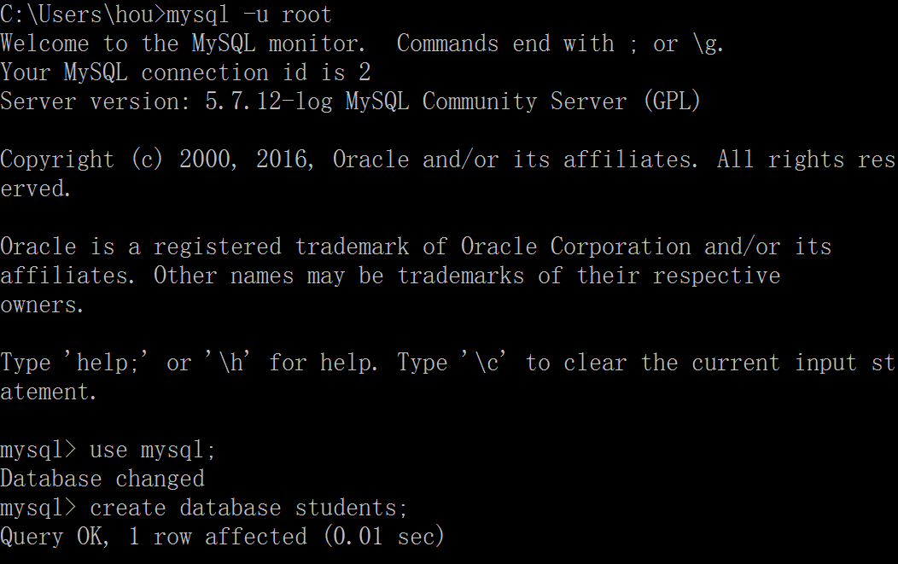
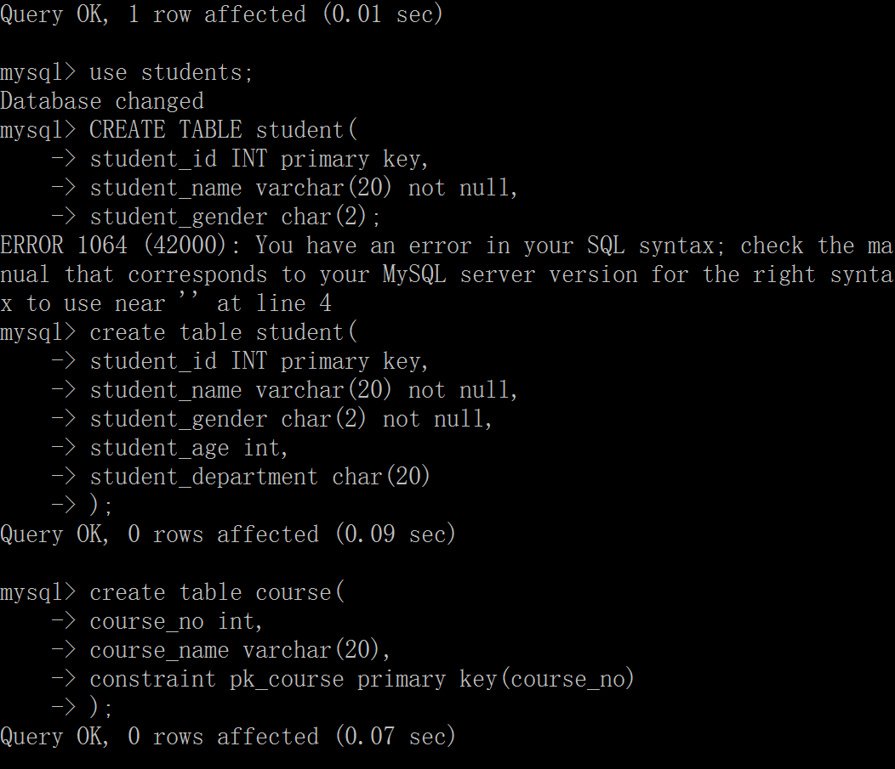
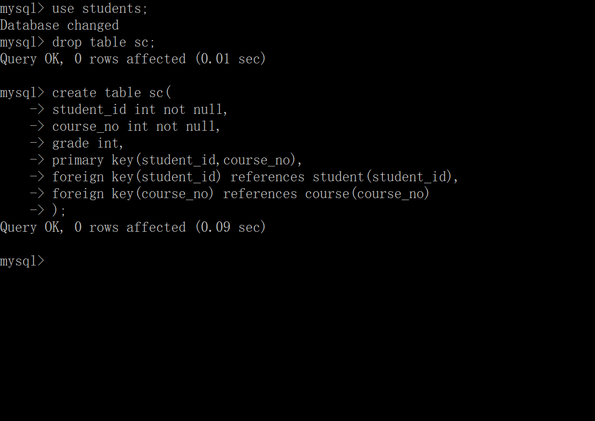
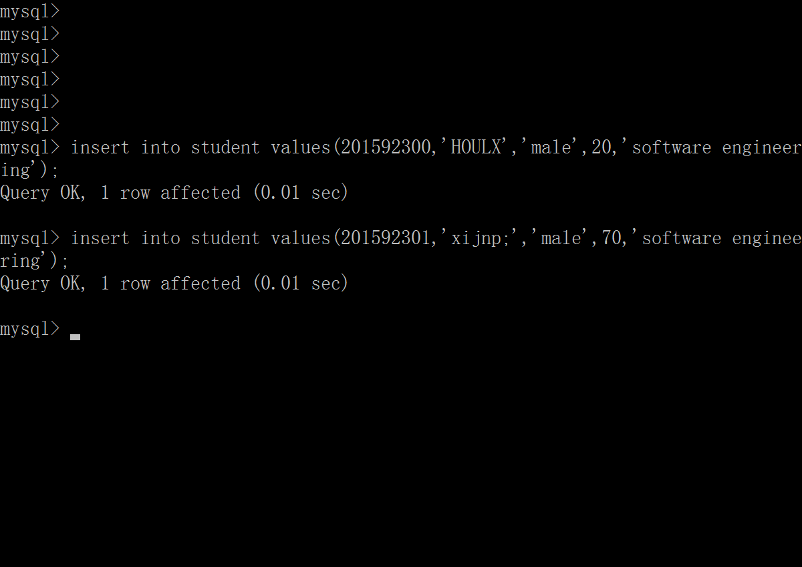
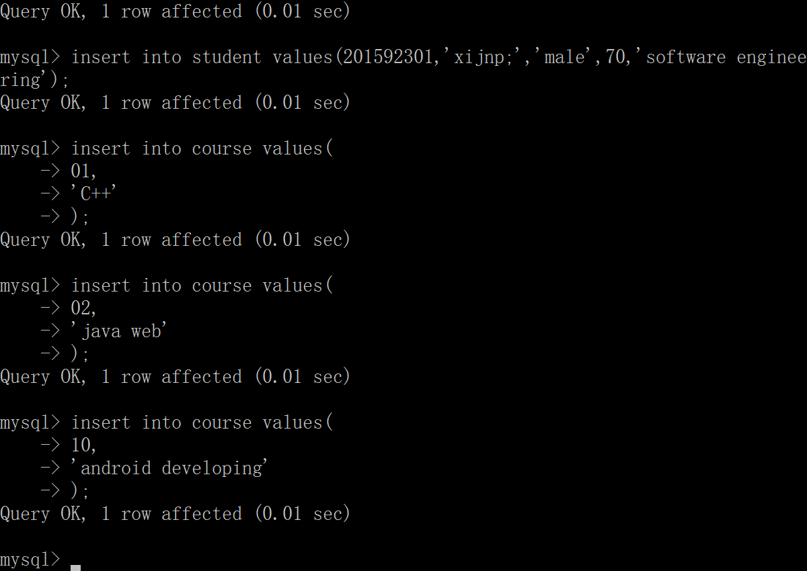
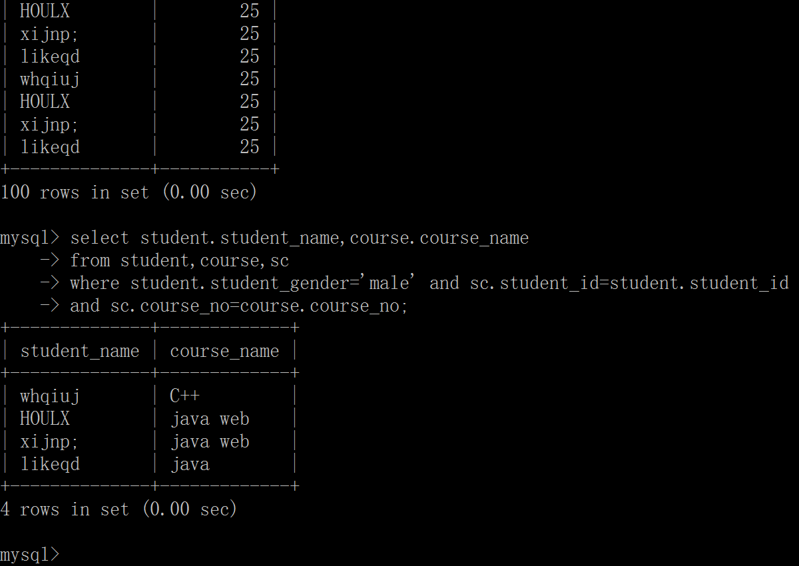
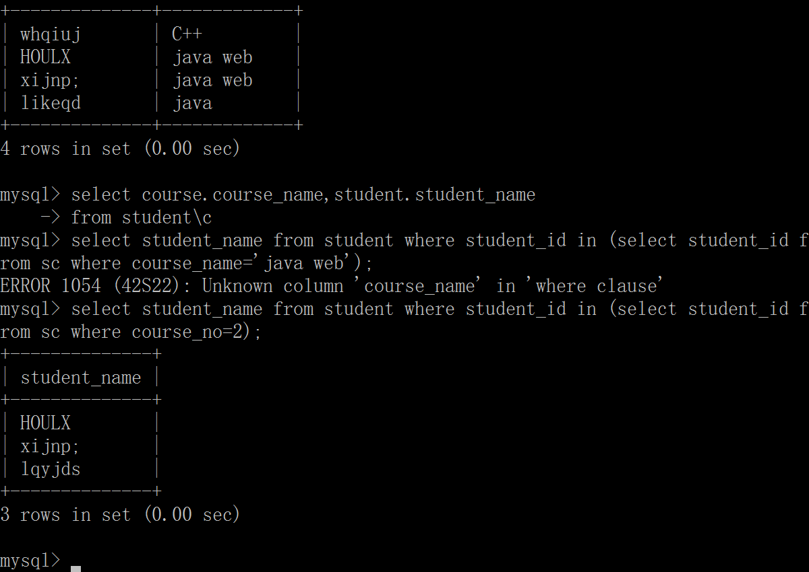

#Java Web 数据库作业

###1.建立一个数据库students
```SQL
mysql -u root
mysql>use mysql;
mysql>create database students;
```


###2.在student中建立3个表，student，course，sc
```SQL
mysql>use students;
mysql>create table...
```



###3.编制数据输入到3个表中
```SQL
mysql>insert into student values(...)
```



###4.查询
* 查询各位同学的选课清单


* 查询男生


* 查询每门课

